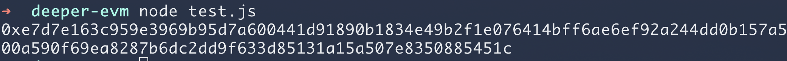
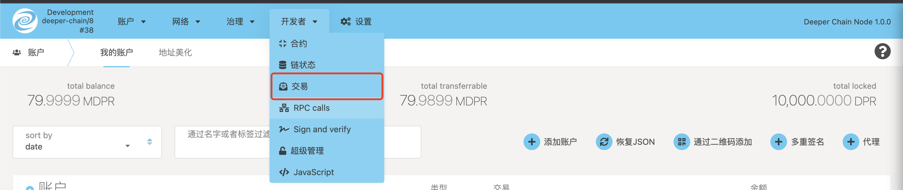
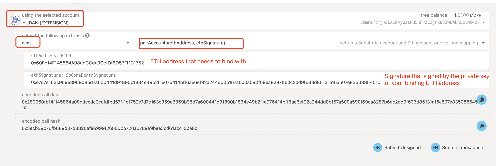
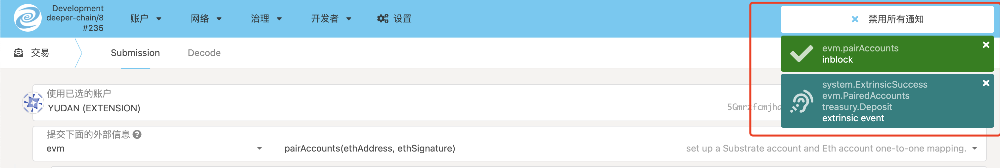
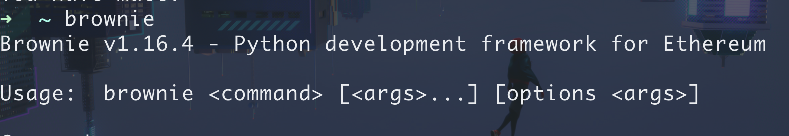
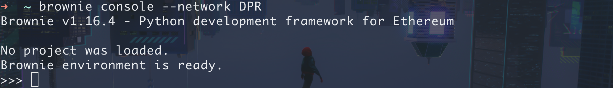
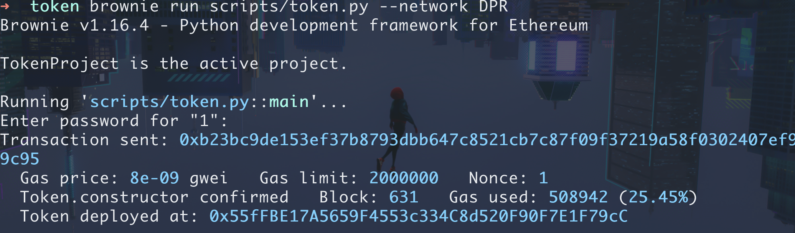

# Deeper Chain EVM Course Lecture 1 - How to Deploy Contracts
## Outline
- Bind address in Deeper Chain
- Download the interactive contract framework Brownie
- Interaction with Deeper Chain EVM using Brownie framework
- Simple contract deployment using Brownie Token templates
- Use Brownie for the corresponding operation of the contract

## Deeper Chain address binding
Since Deeper Chain is compatible with the EVM kernel in the architecture of Substrate, there are two sets of addresses on Deeper Chain itself, one is the Substrate address we are using ourselves, and the other is the one we are about to use for EVM. The address to perform the operation on (Ethereum address). However, since the balance of the Substrate address and the Ethereum address are synchronized, we must bind our Ethereum address to our corresponding Substrate address in order to obtain the corresponding balance for interaction. The following are the corresponding steps for binding an address.

### Binding preparation
1. Generate an Ethereum address using MetaMask, click Create Account to generate a new address
2. Generate a Substrate address using Polkadot{.js}
3. Export the private key of the corresponding account to prepare for the binding address
4. Download the [here](https://github.com/deeper-chain/deeper-chain/blob/dev/frontier/scripts/account_utils.js) script for backup and the `web3` library included in the script and the `truffle-privatekey-provider` library
5. Fill in the corresponding comment section of the script, and uncomment it, sub_address should use a non-`ss58` encoded address instead of an `ss58` encoded address. For example, the address I want to bind is `5GmrzfcmjhaEX1R4yGstPU5hFrZC3jHKB33wUwknQciNG4Z7`, then the substrate address I need to fill in should be `d054c19be6989d0b5e416bdc8bd67d78365d923b528ade23dc3213eb09f8a705`. Other than this, there are no special requirements for other fields.

    ```js
    const eth_private_key = 'Your eth account private key';
    const eth_address = 'Your eth account';

    const sub_address = 'Your substrate account';
    ``` 
5. Run the script to generate the corresponding signature, save the signature, and prepare for the binding operation



### Bind address
1.Open our background management page, take the local panel as an example, select the `Developer -> Transaction` tab to enter the transaction call page


2. After entering the transaction call page, you need to configure the following:
(1) Change the calling account to your own account
(2) Selects evm module
(3) Selects the action called pairAccounts

Then click the submit transaction button below to submit, and see the prompt in the red box below, indicating that the binding is successful.
 

## Download the interactive contract framework Brownie

### Downloads for Brownie
1. First, the python environment is required to be above 3.5
2. Download pipx

    ```py
    python3 -m pip install --user pipx
    python3 -m pipx ensurepath
    ```

3. Download Brownie via pipx
    ```py
    pipx install eth-brownie
    ```
4. After the download is complete, the following information can be correctly prompted
    


## Interaction with Deeper Chain EVM using Brownie framework

### Import private key using Brownie
1. Use the private key of the Ethereum address we just generated to import through Brownie to generate a Brownie account, fill in the corresponding private key as shown below, and enter the corresponding unlock password


### Add Deeper Chain network
1. Use the following command to add the rpc address we need to interact with through Brownie. Taking the local network as an example, the added rpc address is `http://localhost:9933`, and the chainId is `43`

    ```sh
    brownie networks add "Deeper Network" "DPR" host="http://127.0.0.1:9933" chainid="43"
    ```
### Launch a local interactive operating environment with Brownie
1. Use the following command to enter the interactive environment of Brownie's specified network
    ```sh
    brownie console --network DPR
    ```
    At the same time, you will see the following prompt
    

### Interactive operation with Brownie
1. Use the following command to unlock the account
    ```py
    accounts.load(1)
    ```
    

2.  The following interactive operations can be performed. For more interactive operations, please refer to the official documentation of Brownie
    - Balance query
     
    - Address query
     


## Simple contract deployment using Brownie Token templates
1. Create a new empty folder to store the Brownie contract templates
2. Enter the blank folder and use the following command to initialize the Brownie token contract template
    ```sh
    brownie bake token
    ```
3. Use the following commands to deploy contracts in the Deeper Chain network using Brownie's predefined scripts
    ```sh
    brownie run scripts/token.py --network DPR
    ```
    

## Contract Interaction with Brownie
1. To use Brownie for contract interaction, then we must rewrite the script provided by Brownie, taking transfer as an example, the corresponding modifications are as follows:

    ```py
    #!/usr/bin/python3

    from brownie import *


    def main():
        accounts.load(1)
        t = Token.deploy({'from': accounts[0], "gas_limit":2000000})

        # transfer action
        gas_limit = t.transfer.estimate_gas(accounts[0], Wei('2000 ether'))
        transaction = t.transfer(accounts[0], Wei('2000 ether'), {"gas_limit":gas_limit}
    ```