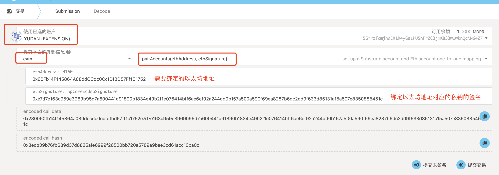

# Deeper Chain EVM 课程第一讲 -- 如何部署合约
## 大纲
- 在 Deeper Chain 中绑定地址
- 下载交互式合约框架 Brownie
- 使用 Brownie 框架对 Deeper Chain EVM 进行交互性操作
- 使用 Brownie Token 模版进行简单的合约部署
- 使用 Brownie 进行合约的相应操作

## Deeper Chain 地址绑定
Deeper Chain 由于是在 Substrate 的架构上兼容了 EVM 内核，所以在 Deeper Chain 上本身是有 2 套地址，一套是我们本身就在使用的 Substrate 地址，一套是我们即将要使用的用于对 EVM 进行操作的地址(以太坊地址)。但由于 Substrate 地址和 以太坊地址的余额是同步的，所以我们必须要将我们的以太坊地址绑定到我们对应的 Substrate 地址上，才能获得对应的余额进行交互。以下为绑定地址的对应步骤。

### 绑定准备
1. 使用 MetaMask 生成一个以太坊地址，点击创建账户以生成一个新的地址
2. 使用 Polkadot{.js} 生成一个 Substrate 地址
2. 导出对应账户的私钥，为绑定地址做准备
3. 下载[此处](https://github.com/deeper-chain/deeper-chain/blob/dev/frontier/scripts/account_utils.js)脚本进行备用，同时应下载脚本中所包含的 `web3` 库和 `truffle-privatekey-provider` 库
4. 填充脚本对应的注释部分，并取消注释，sub_address 要使用非 `ss58` 编码的地址, 而不是用 `ss58` 编码后的地址。例如我要绑定的地址是 `5GmrzfcmjhaEX1R4yGstPU5hFrZC3jHKB33wUwknQciNG4Z7`，那么实际上我需要填写的 substrate 地址应该是 `d054c19be6989d0b5e416bdc8bd67d78365d923b528ade23dc3213eb09f8a705`。除了这点之外，其他字段没有特殊要求。

    ```js
    const eth_private_key = 'Your eth account private key';
    const eth_address = 'Your eth account';

    const sub_address = 'Your substrate account';
    ``` 
5. 运行脚本生成对应的签名，保存好这个签名，为绑定操作做准备


### 绑定地址
1. 打开我们的后台管理页面，以本地面板为例，选用 `开发者->交易` 选卡，进入交易调用页面


2. 进入交易调用页面后，需进行以下配置:
(1) 将调用账户改成自己的账户
(2) 模块选用 evm 模块
(3) 调用的操作选择 pairAccounts

然后点击下方的提交交易按钮进行提交，看到下图红框处提示，即表明绑定成功。
 

## 下载交互式合约框架 Brownie

### Brownie 的下载
1. 首先需要 python 环境在 3.5 以上
2. 下载 pipx 

    ```py
    python3 -m pip install --user pipx
    python3 -m pipx ensurepath
    ```

3. 通过 pipx 下载 Brownie
    ```py
    pipx install eth-brownie
    ```
4. 下载完成后可正确提示以下信息
    


## 使用 Brownie 框架对 Deeper Chain EVM 进行交互性操作

### 使用 Brownie 导入私钥
1. 使用我们刚才生成的以太坊地址的私钥通过 Brownie 进行导入，生成 Brownie 账户，按下图提示填入对应私钥，并输入对应的解锁密码


### 添加 Deeper Chain 网络
1. 使用以下命令 通过 Brownie 添加我们需要交互的 rpc 地址，以本地网络为例，添加的 rpc 地址为 `http://localhost:9933`，chainId 则为 `43`

    ```sh
    brownie networks add "Deeper Network" "DPR" host="http://127.0.0.1:9933" chainid="43"
    ```
### 通过 Brownie 启动本地交互式操作环境
1. 使用以下命令，进入 Brownie 指定网络的交互式环境
    ```sh
    brownie console --network DPR
    ```
    同时将看到如下提示
    

### 通过 Brownie 进行交互式操作
1. 使用以下命令，解锁账户
    ```py
    accounts.load(1)
    ```
    

2.  可进行以下交互性操作，更多交互式操作可参考 Brownie 官方文档
    - 余额查询
     
    - 地址查询
     


## 使用 Brownie Token 模版进行简单的合约部署
1. 新建一个空白文件夹，用于存储 Brownie 合约模版
2. 进入空白文件夹，使用以下命令，初始化 Brownie token 合约模版
    ```sh
    brownie bake token
    ```
3. 使用以下命令，利用 Brownie 预定义的脚本在 Deeper Chain 网络中进行合约部署
    ```sh
    brownie run scripts/token.py --network DPR
    ```
    

## 使用 Brownie 进行合约交互
1. 若要使用 Brownie 进行合约交互，那么我们必须改写 Brownie 提供给我们的脚本，以转账为例子，对应的修改如下：

    ```py
    #!/usr/bin/python3

    from brownie import *


    def main():
        accounts.load(1)
        t = Token.deploy({'from': accounts[0], "gas_limit":2000000})

        # transfer action
        gas_limit = t.transfer.estimate_gas(accounts[0], Wei('2000 ether'))
        transaction = t.transfer(accounts[0], Wei('2000 ether'), {"gas_limit":gas_limit}
    ```