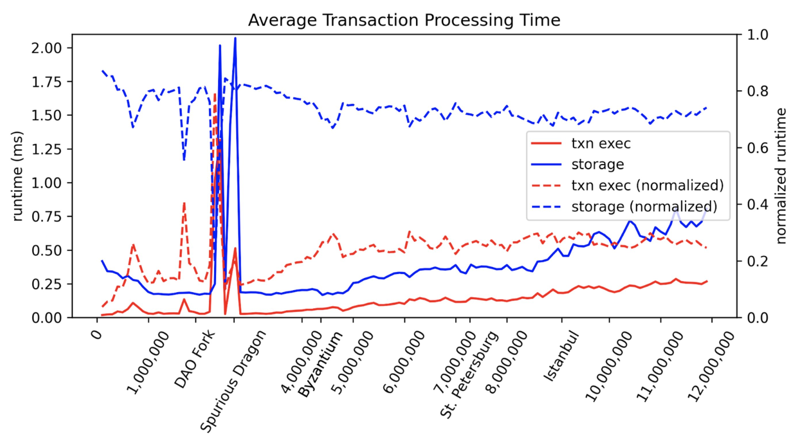

# Optimization

Feeling that your blockchain isn't running fast enough? Then you need optimization!

## Avoid premature optimization

> The real problem is that programmers have spent far too much time worrying about efficiency in the wrong places and at the wrong times; premature optimization is the root of all evil (or at least most of it) in programming.[^knuth]

First of all, it's important that one avoids premature optimization. This means that one must first understand where exactly the blockchain is running slow. Otherwise, one can be stuck in optimizing an unimportant area for years with no real performance gain. Choose the correct thing to optimize! If an area relates to only 20% of the performance, even by optimizing that over the roof, you'll at most get 1.25x performance gain. On the other hand, if one optimizes the area that relates to 80% of the performance, then 5x potential performance gain is possible.

Choosing the right area usually involves benchmarking. It's also important to understand one's userbase. In our case, that means understanding which kinds of smart contracts are usually deployed and specifically benchmark for those.

## Understand what can be optimized

Related to Frontier, there are three areas that are normally important:

* Consensus and networking
* Storage IO
* VM execution

In the Frontier codebase, we don't directly deal with consensus and networking, and thus our focus would be on storage IO and VM execution. We do want to note that there are still a lot of potential things that can be optimized in consensus and networking especially if one runs a L1 (solo chain). If one runs a L2 (Polkadot parachains or Cardano partner chain), then the consensus and networking is usually fixed and can only be optimized through upstream.

## Storage vs VM

Before we proceed, let's first understand what we mean by "storage IO" and "VM execution".

* **Storage IO**: The engine starts by fetching the smart contract bytecode, account balances, and other related storage items.
* **VM execution**: The engine then starts the actual VM execution running EVM bytecodes. Note that here the engine may still fetch additional values from the storage (via `SLOAD` opcode, for example), which we count in VM execution. It stores all changed storage values normally in a hashmap but does not build the merkle trie yet.
* **Storage IO**: The engine finalizes the execution, and all changed storage values are built in the merkle trie and put into disk storage.

If one uses Frontier, then one probably is here for the full Ethereum and EVM compatibility. In this case, we can make a reasonable assumption that our userbase will be similar to that of Ethereum, and developers will deploy similar smart contracts. It is therefore really useful to take a look at existing benchmarks on Ethereum mainnet. What are our current bottlenecks? Is it storage IO? Or is it VM execution?

In 2021, Hongbo Zhang published a benchmark of historical Ethereum block benchmarks[^zhang]. The benchmark showed that the EVM engine normally spends around 70% of the time in **storage IO**, and 30% of the time in **VM**. This benchmark was echoed by many of the later works. For example, in 2024, Paradigm team released the `revmc` recompiler that in some cases archived more than 10x speed up in **VM execution**. Yet, after integrating it into Reth and syncing historical Ethereum blocks, they found only "O(1-10%)" improvements because most workloads aren't compute-heavy (but rather IO-heavy).

Even inside VM execution, the major bottleneck is still **storage IO**. `SLOAD` opcode itself alone takes around 30% of the time in **VM execution**.

All things considered, this means that **storage IO relates to around 80% of the performance**, while VM execution only relates to a minor portion, around 20% of the performance.

## Focuse on storage IO

We therefore recommend that optimization is focused on **storage IO**, rather than **VM execution**. Consider saving unnecessary storage access in runtime. If certain storage values are always accessed together, consider combining them into a single storage item. Integrate [NOMT](https://www.rob.tech/blog/introducing-nomt/).

## Tweak parameters

It's also important to check whether one's blockchain is really already performance-bottlenecked, or it is simply certain parameters set incorrectly. For example, in certain situations, simply raise the block gas limit may be sufficient to increase the throughput.

## Not make things worse

In Polkadot parachains, the performance is bottlenecked by Proof-of-Validity (PoV) size limit. If the smart contract size becomes larger due to VM execution optimization, then this will actually result in worse performance, because now, within the PoV size limit, less contracts can fit. As PolkaVM contracts are usually 10x (sometimes even 80x or more) larger than the equivalent EVM contracts, we recommend that PolkaVM contracts are used only for specifically compute-heavy workload and all other contracts to be deployed in EVM bytecode. 

[^knuth]: Donald Knuth, *The Art of Computer Programming*
[^zhang]: Hongbo Zhang (Cornell), [*What makes EVM slow?*](https://www.youtube.com/watch?v=2_GX8iCVNrA)
